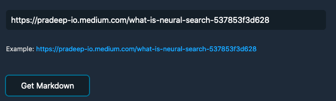

# medium-to-markdown
Convert medium link to markdown

## Screenshots

## How to use the hosted version

1. Visit the website
2. Enter medium article link
3. Review the generated markdown
4. Edit if you need any fixes or additions
5. Use the final markdown

## Setup locally

1. Clone the repo
2. Install dependencies `npm install`
3. Run the server `npm start`
